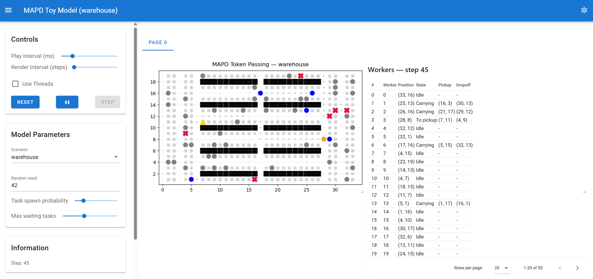

# MAPD Toy Model

A Python/Mesa implementation of the Token Passing (TP) algorithm for Multi-Agent Pickup and Delivery (MAPD), based on the work of Ma et al. [1].

The project explores how decentralised agents can coordinate pickup and delivery tasks using a shared token containing task assignments and collision-free paths. Agents request the token when they become free, select tasks using TP's heuristic task selection strategy, and plan space-time aware paths that avoid conflicts with paths already stored in the token.

This project is an educational and research-oriented implementation and is not intended to be a complete reproduction of the original TP algorithm. Some preprocessing steps and theoretical guarantees described in the paper are still under development.

# Features

- Mesa-based agent simulation
- Orthogonal Von Neumann grid environment
- Space-time aware A* planning
- Shared Token Passing coordination
- Dynamic pickup and delivery task generation
- Task selection using estimated completion cost
- Path1 implementation
- Path2 implementation
- Endpoint-based warehouse environments
- Multiple configurable scenarios
- Deterministic execution via random seeds
- Browser visualisation using SolaraViz
- Collision detection and debugging tools
- Simulation metrics collection
- Timestamped experiment logging

# Scenarios

The simulation supports multiple predefined scenarios:

| Scenario | Description |
|-----------|-------------|
| random | Randomly generated environment |
| test | Small deterministic debugging environment |
| warehouse | Warehouse-style endpoint layout inspired by MAPD literature |

All scenarios follow the MAPD endpoint model described in the TP paper:

- task endpoints are valid pickup and delivery locations
- resting endpoints are locations where idle agents may wait
- initial agent locations are resting endpoints
- task endpoints and resting endpoints are disjoint
- blocked cells never overlap with endpoints
- all endpoints remain mutually reachable

Scenarios define:

- grid dimensions
- worker count
- endpoint locations
- blocked cells
- task generation locations

# Running the Simulation

## Browser Visualisation

```bash
solara run code/app.py
```

Then open:

```text
http://localhost:8765
```

The browser interface displays:

- worker agents
- active pickup locations
- active drop-off locations
- blocked cells
- planned agent paths
- live agent movement



## Console Mode

```bash
python code/run.py --scenario warehouse --seed 42 --steps 500
```
# Results and Logging

Simulation outputs are saved into timestamped directories inside `results/`.

Generated outputs may include:

- model-level metrics CSVs
- agent-level metrics CSVs
- simulation log files

Logging currently includes:

- task generation
- token interactions
- task assignment
- reservation updates
- reservation conflicts
- worker movement
- path planning
- collision events
- parking behaviour


# How It Works

The implementation follows the Token Passing (TP) algorithm.

The token stores:

- active tasks
- planned paths for each worker

When a worker reaches the end of its path and becomes free, it requests the token.

The worker:

1. Selects an available task whose pickup and delivery locations are not currently occupied by the endpoint of another token path.
2. Uses Path1 to plan a collision-free path via the pickup location to the delivery location.
3. Updates its token path.
4. Releases the token.

If no suitable task exists, the worker executes Path2 and plans a path to a safe resting endpoint.

Workers then execute their token paths until reaching the end, at which point they may request the token again.

# Current Limitations

The implementation is currently a research prototype.

Known limitations include:

- occasional collision bugs still exist
- heuristic preprocessing from the TP paper is not yet implemented
- blocked-cell-aware endpoint distance tables are not yet precomputed
- no performance optimisation
- limited benchmark environments
- limited validation against published MAPD benchmarks

## Future Work
- Endpoint distance preprocessing
- Full TP completeness validation
- Comparison against Cooperative A*
- Comparison against reservation-table approaches
- MAPD benchmark reproduction
- Performance evaluation


# Motivation

The aim of this project is to gradually build towards a working MAPF/MAPD simulation, starting from the smallest useful components:

- grid movement
- task assignment
- path planning
- dynamic task generation
- multi-agent coordination
- reservation-based planning
- token-based coordination
- parking/endpoint management

The project is intended as a learning exercise in:

- agent-based simulation
- pathfinding algorithms
- multi-agent systems
- cooperative planning
- MAPF/MAPD research concepts

# References

[1] Ma, G., Hönig, W., Kumar, T. K. S., & Koenig, S. (2017).
*Lifelong Multi-Agent Path Finding for Online Pickup and Delivery Tasks*.
Proceedings of the 16th International Conference on Autonomous Agents and MultiAgent Systems (AAMAS 2017), 837–845.

Available at: https://www.ifaamas.org/Proceedings/aamas2017/pdfs/p837.pdf 